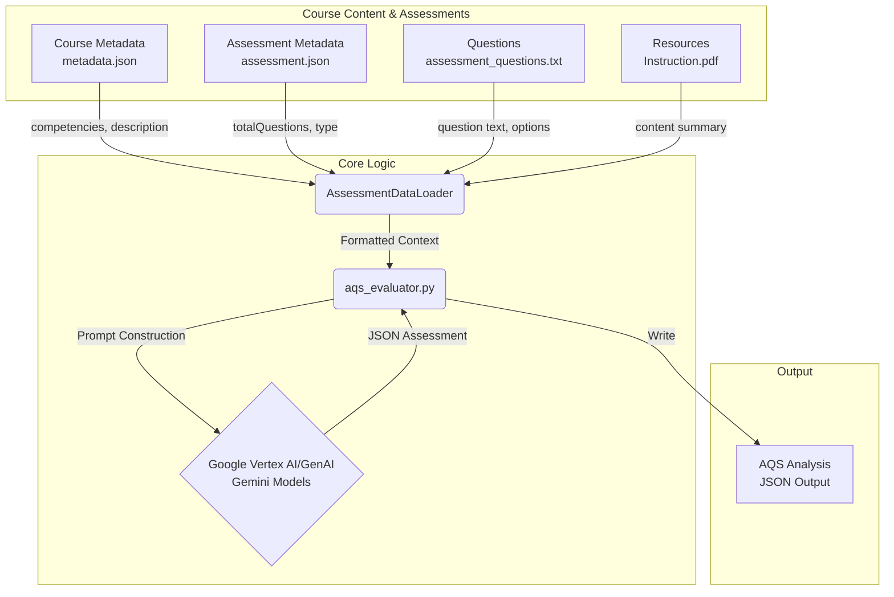
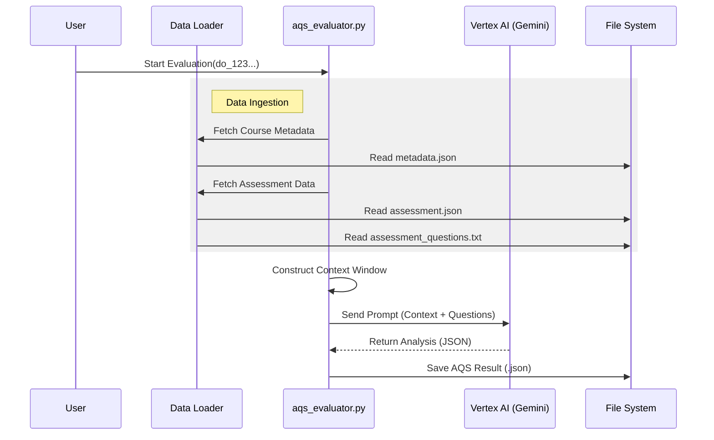

# AQS System Design Document

This document outlines the architectural design and request flow of the Assessment Quality Score (AQS) system, detailing the data ingestion and analysis pipeline.

## 1. Architecture Overview

The system operates as a backend analysis pipeline:
`Data Ingestion` -> `Schema Validation` -> `AI Evaluation` -> `Result Persistence`

### Data Flow Diagram

## 2. Course Content & Assessments (Data Schema)

The system ingests data from a structured directory (e.g., `data/data_point/`).

### A. Data Source: `data/data_point`

The input data is split into **Course Context** and **Assessment Data**.

#### 1. Assessment Metadata (`assessment.json`)

Contains configuration and behavioral settings for the assessment.

- **Key Fields**:
  - `totalQuestions`: Number of questions (e.g., `100`).
  - `primaryCategory`: Type of assessment (e.g., `"Course Assessment"`).
  - `expectedDuration`: Time limit in seconds.
  - `maxQuestions`: Max questions to serve.
  - `code`: Unique code identifier.

#### 2. Assessment Questions (`assessment_questions.txt`)

Contains the actual content to be analyzed.

- **Format**: Structured text file.
- **Schema**:
  - `Question Text`
  - `Type` (e.g., Multiple Choice Question)
  - `Options` (A, B, C, D...)
  - `Correct Answer` (Index/Value)

#### 3. Course Metadata (`Course/.../metadata.json`)

Provides the curriculum context against which the assessment is evaluated.

- **Key Fields**:
  - `name`: Course Name.
  - `description`: Learning objectives and scope.
  - `competencies`: List of skills covered.
  - `primaryCategory`: e.g., "Learning Resource".

#### 4. Content Resources (`Instruction.pdf`)

- **Role**: Provides the source material for Validating "Course Fit" and "Hallucination Check".
- **Processing**: PDF text is extracted and summarized to form the "Ground Truth" context in the AI Prompt.

## 3. Request Flow Details

### Phase 1: Evaluation Analysis (`aqs_evaluator.py`)

1. **Initiation**: Script is called with a target `do_id`.
2. **Data Loading**:
   - `AssessmentDataLoader` parses `assessment.json` and `metadata.json`.
   - Questions are read from `assessment_questions.txt` and converted to a list of `Question` objects.
   - PDF content (if available) is read and chunked.
3. **Prompt Engineering**:
   - A massive prompt is constructed combining:
     - **System Role**: "You are an expert Pedagogy Analyst..."
     - **Course Context**: "This assessment belongs to [Course Name]..."
     - **Question Data**: Full text of questions and options.
     - **Rubric**: Definitions for Difficulty, Bloom's Taxonomy, and Course Fit.
4. **AI Request**:
   - **Service**: Google Vertex AI.
   - **Models**:
     - `gemini-3-flash-preview`
     - `gemini-2.0-flash`
     - `gemini-2.5-flash`
   - **Params**: `temperature=0.1` (Deterministic).
5. **Persistence**:
   - The structure response is saved as `all_assessments_aqs.json`.

## 4. Component Interaction (Sequence)

## 5. Key Design Decisions

1. **Separation of Data and Logic**:
   - Data is ingested from standard JSON/Text files, decoupling the evaluator from any specific database.
2. **Single-Shot Analysis**:
   - All dimensions (Difficulty, Bloom's, Fit) are evaluated in a single API call to maximize context awareness and minimize cost.
